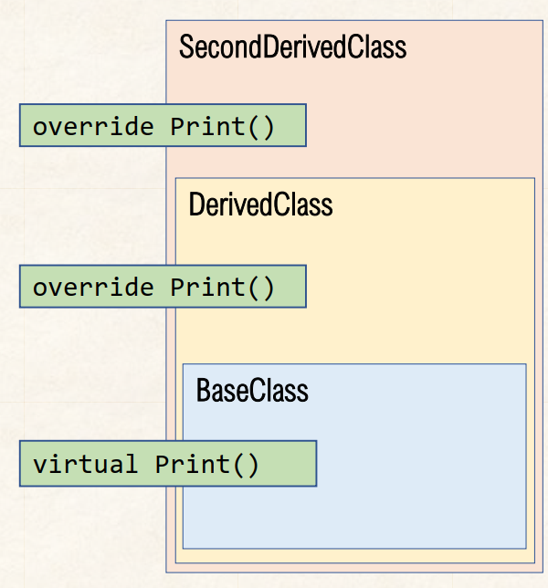

# Lab 9 Exercise 3

## Override overridden Method


1.สร้าง console application project

```cmd
dotnet new console --name Lab09_Ex03
```

2.เปลี่ยน code ให้เป็นดังต่อไปนี้

```cs
SecondDerivedClass sdRef  = new SecondDerivedClass();
BaseClass bcRef = (BaseClass) sdRef;

sdRef.Print();
bcRef.Print();

class BaseClass
{
    virtual public void Print()
    {
        System.Console.WriteLine("Hello from BaseClass");
    }
}
class DerivedClass : BaseClass
{
    override public void Print()
    {
       System.Console.WriteLine("Hello from DerivedClass");
    }
}
class SecondDerivedClass : DerivedClass
{
    override public void Print()
    {
       System.Console.WriteLine("Hello from SecondDerivedClass");
    }
}
```

3.Build project โดยการใช้คำสั่ง

```cmd
dotnet build  Lab09_Ex03
```

ถ้ามีที่ผิดพลาดในโปรแกรม ให้แก้ไขให้ถูกต้อง

4.บันทึกผลที่ได้จากการรันคำสั่งในข้อ 3


5.Run project โดยการใช้คำสั่ง

```cmd
dotnet run --project Lab09_Ex03
```

6.บันทึกผลที่ได้จากการรันคำสั่งในข้อ 5


7.อธิบายสิ่งที่พบในการทดลอง

โปรแกรมจะแสดงผล
Hello from SecondDerivedClass
Hello from SecondDerivedClass
